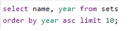
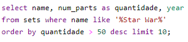
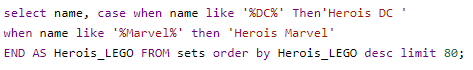
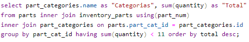
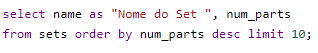

 

<h1 align='center'>LEGO DATABASE</h1>

 

  <h1>O que é para fazer? ✨</h1>
  

    Projeto em grupo do <b>módulo 4</b> proposto pela <b>Resilia educação.</b>
    Nesse projeto você e sua squad deverão montar
    um dashboard com base no conjunto de dados
    escolhidos por vocês, a fim de realizar uma
    apresentação com a exploração dos dados.
  

 
<h1>Queries utilizadas para as consultas: </h1>

 

<h2><i>1° Quais são os sets mais antigos ?</i></h2>

 

<h2><i>2° Quais sets de Star Wars possuem mais de 50 peças ?</i></h2>

 

<h2><i>3° Consegue agrupar e exibir os sets dos Heróis da Marvel e DC ?</i></h2>

 

<h2><i>4° Quais categorias possuem menos de 10 peças no inventário ?</i></h2>

 

<h2><i>5° Quais são os sets com o maior número de peças ?</i></h2>

 
 

